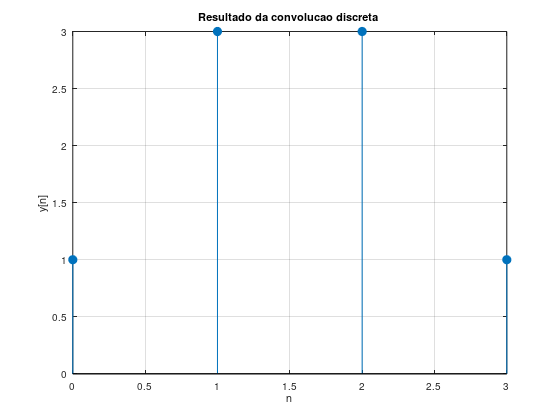
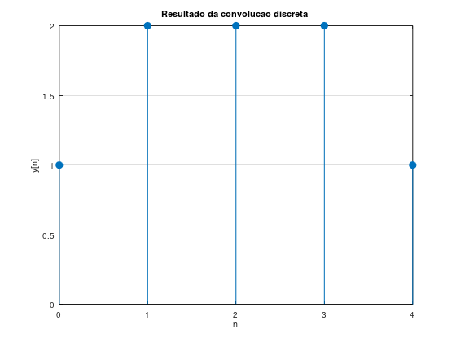

# Atividade 4 – Implementação Computacional da Convolução

Nesta atividade foi utilizado o comando `conv(x,h)` do Octave/MATLAB para realizar a convolução discreta entre o sinal de entrada e a resposta ao impulso do sistema.

Considerando:

$$
h[n] = \{1,1\}
$$

foram realizados dois testes computacionais.

---

## 1) Execução do código e comparação com o cálculo manual

### Primeiro teste: $x[n] = \{1,2,1\}$

No código:

```octave
x = [1 2 1];
h = [1 1];
y = conv(x,h);
``` 
o resultado obtido foi:


$$
y[n]={1,3,3,1}
$$

Esse valor coincide exatamente com o resultado encontrado manualmente na Atividade 2.

Portanto, verifica-se que o comando `conv` implementa corretamente a soma das sobreposições entre as duas sequências.

O gráfico gerado apresenta:

valor inicial igual a 1<br>
dois valores centrais iguais a 3 <br>
valor final igual a 1. <br>

Isso forma um sinal discreto simétrico com pico central.  


### 2) Explicação da forma do sinal de saída obtido

A forma do sinal observada no gráfico ocorre devido ao grau de sobreposição entre $x[n]$ e $h[n]$ durante a convolução.

Como $h[n] = {1,1}$, cada ponto da saída corresponde à soma de duas amostras consecutivas da entrada.

No primeiro instante existe apenas uma multiplicação possível, por isso a saída começa em 1.

Nos instantes centrais ocorre a maior superposição entre as sequências, fazendo com que as somas sejam maiores:

1+2=3

e

2+1=3

No último instante resta novamente apenas uma contribuição, retornando ao valor 1.

Assim, o gráfico apresenta crescimento, manutenção no pico e posterior decaimento:

{1,3,3,1}

Esse formato indica que o sistema espalha a influência da amostra central de maior amplitude para as posições vizinhas.

### 3) Modificação da entrada para $x[n] = {1,1,1,1}$ e interpretação do novo resultado

Alterando a entrada para:
```octave 
x = [1 1 1 1];
h = [1 1];
y = conv(x,h);
```

obtém-se:

y[n]={1,2,2,2,1}

O novo gráfico apresenta:

valor inicial 1 <br>
três valores centrais iguais a 2 <br>
valor final 1 <br>



### Interpretação

Neste caso todas as amostras de entrada possuem a mesma amplitude.

Durante a convolução:

no início há apenas uma sobreposição;
na região central sempre existem duas contribuições iguais;
no final volta a existir apenas uma contribuição.

Como cada soma central é:

1+1=2

a saída passa a ter um trecho plano no meio:

{1,2,2,2,1}

Diferentemente do primeiro experimento, agora não existe um pico mais elevado, pois a entrada não possui nenhuma amostra dominante.

Isso significa que o sistema responde de maneira uniforme quando excitado por uma sequência uniforme.

Comparação entre os dois gráficos obtidos
Para $x[n] = {1,2,1}$
y[n]={1,3,3,1}

O gráfico apresenta pico central mais alto porque a amostra central da entrada possui maior valor.

Para $x[n] = {1,1,1,1}$
y[n]={1,2,2,2,1}

O gráfico apresenta uma região central constante porque todas as amostras contribuem igualmente.

Conclusão

A implementação computacional confirmou o cálculo manual e mostrou visualmente o comportamento da convolução discreta.

Foi possível observar que:

a saída sempre depende da quantidade de sobreposição entre as sequências;
entradas com pico central geram saídas com picos maiores;
entradas uniformes produzem saídas mais planas e regulares.

Assim, a convolução evidencia como a resposta ao impulso do sistema modifica e redistribui as amplitudes do sinal de entrada ao longo do tempo.