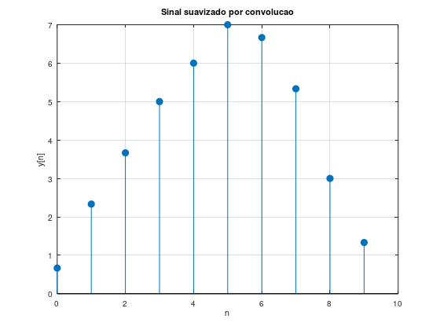

# Atividade 5 – Suavização de Sinais

Considere o sinal discreto de entrada:

$$
x[n] = \{2, 5, 4, 6, 8, 7, 5, 4\}
$$

e o filtro de média simples:

$$
h[n] = \frac{1}{3}\{1, 1, 1\}
$$

Esse filtro distribui igualmente o peso entre três amostras consecutivas, realizando uma média móvel no sinal.

---

## 1) Realização da convolução entre $x[n]$ e $h[n]$

A convolução discreta é dada por:

$$
y[n] = x[n] * h[n]
$$

Como o filtro possui três coeficientes iguais a $\frac{1}{3}$, cada valor da saída será a média entre três contribuições adjacentes da entrada.

Efetuando a convolução, obtém-se:

$$
y[n] = \left\{ 0.67, 2.33, 3.67, 5, 6, 7, 6.67, 5.33, 3, 1.33 \right\}
$$

(Valores aproximados com duas casas decimais.)

Percebe-se que a sequência de saída possui comprimento maior que a sequência original, pois na convolução o tamanho final é dado por:

$$
L_y = L_x + L_h - 1
$$

Logo:

$$
L_y = 8 + 3 - 1 = 10
$$

---

## 2) Apresentação e análise do gráfico do sinal original e do sinal filtrado

O sinal original apresenta oscilações entre os valores:

$$
2, 5, 4, 6, 8, 7, 5, 4
$$

ou seja, existem subidas e descidas relativamente bruscas entre amostras consecutivas.

Após a aplicação do filtro, o gráfico do sinal convoluído mostra a sequência:

$$
0.67, 2.33, 3.67, 5, 6, 7, 6.67, 5.33, 3, 1.33
$$

Observa-se visualmente que:

- O crescimento do sinal ocorre de forma gradual;
- O pico máximo deixa de ser abrupto;
- A descida também se torna mais suave;
- Desaparecem variações repentinas entre amostras vizinhas.

No gráfico filtrado, a curva discreta assume um comportamento mais contínuo e menos irregular do que no sinal original.

Isso mostra que a convolução reduziu as flutuações instantâneas do sensor.

---

## 3) Explicação de por que esse filtro atua como suavizador

O filtro:

$$
h[n] = \frac{1}{3}\{1, 1, 1\}
$$

é chamado de filtro de média móvel porque calcula, em cada ponto, a média aritmética de três amostras consecutivas.

Isso significa que nenhum valor isolado da entrada aparece sozinho na saída. Cada amostra é misturada com suas vizinhas.

Por exemplo, se existir um valor muito alto ou muito baixo em determinada posição, ele será compensado pelos valores ao redor, diminuindo sua influência individual.

Assim:

- Picos são reduzidos;
- Vales são elevados;
- Transições bruscas tornam-se mais lentas.

Matematicamente, o filtro distribui a energia do sinal entre amostras próximas, reduzindo variações rápidas de alta frequência.

---

## Conclusão

A convolução com o filtro de média simples produziu um novo sinal:

$$
\{0.67, 2.33, 3.67, 5, 6, 7, 6.67, 5.33, 3, 1.33\}
$$

Esse sinal apresenta mudanças mais graduais que o sinal original, comprovando que o filtro atua como suavizador.