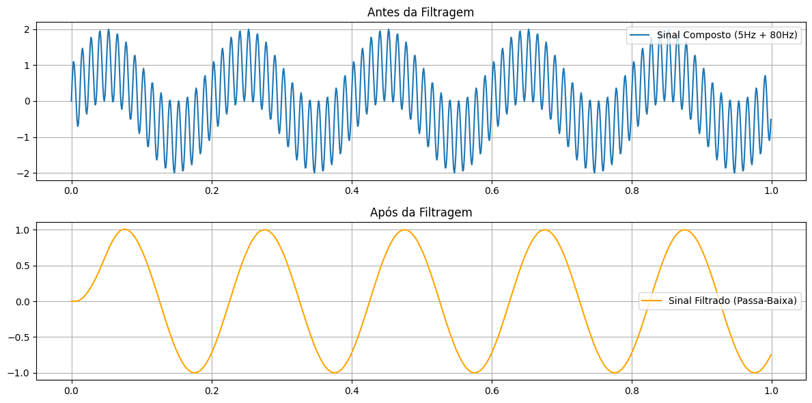

## 1. Código da atividade (Feito no Google Colab)

```python
import numpy as np
import matplotlib.pyplot as plt
from scipy.signal import butter, lfilter

fs = 1000
t = np.linspace(0, 1, fs, endpoint=False)
f1 = 5
f2 = 80

sinal_f1 = np.sin(2 * np.pi * f1 * t)
sinal_f2 = np.sin(2 * np.pi * f2 * t)
sinal_composto = sinal_f1 + sinal_f2

fcorte = 20
b, a = butter(5, fcorte, fs=fs, btype='low')
sinal_filtrado = lfilter(b, a, sinal_composto)

plt.figure(figsize=(12, 6))
plt.subplot(2, 1, 1)
plt.plot(t, sinal_composto, label='Sinal Composto (5Hz + 80Hz)')
plt.grid(True)
plt.legend()
plt.subplot(2, 1, 1).set_title('Antes da Filtragem')

plt.subplot(2, 1, 2)
plt.plot(t, sinal_filtrado, label='Sinal Filtrado (Passa-Baixa)', color='orange')
plt.grid(True)
plt.legend()
plt.subplot(2, 1, 2).set_title('Após da Filtragem')

plt.tight_layout()
plt.show()
```

## 2. Gráficos gerados



### 3. Discussão técnica

Nesta atividade, o sinal de entrada foi modelado combinando duas componentes senoidais puras de frequências distintas. Esse cenário emula uma situação clássica em processamento de sinais, onde uma componente representa a informação útil (geralmente de frequência mais baixa) e a outra representa uma interferência ou ruído de alta frequência sobreposto.

Para realizar a separação, foi projetado um filtro digital passa-baixa. O princípio físico de operação do filtro baseia-se na atenuação seletiva do espectro: frequências localizadas abaixo da frequência de corte (banda de passagem) transitam pelo sistema sofrendo pouca ou nenhuma alteração em sua amplitude. Por outro lado, componentes com frequências significativamente superiores à de corte (banda de rejeição) são atenuadas de forma drástica.

Ao analisar o comportamento do sistema no domínio do tempo, observa-se que o sinal original apresenta uma oscilação rápida e rugosa devido à influência da alta frequência. Após a filtragem, o sinal resultante assume um contorno puramente suave e contínuo, demonstrando que a componente rápida foi eliminada e apenas a senóide de menor frequência permaneceu ativa na saída.


