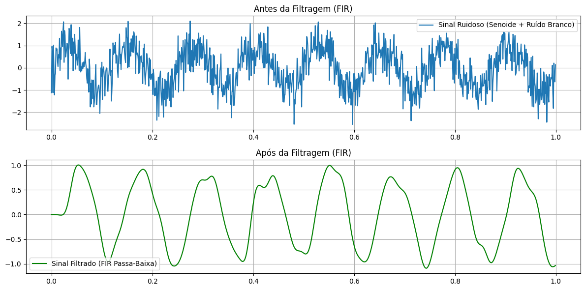

## 1. Código da atividade (Feito no Google Colab)
```jupyter
import numpy as np
import matplotlib.pyplot as plt
from scipy.signal import firwin, lfilter

fs = 1000
t = np.linspace(0, 1, fs, endpoint=False)
f_sinal = 8

sinal_puro = np.sin(2 * np.pi * f_sinal * t)
ruido = np.random.normal(0, 0.6, len(t))
sinal_ruidoso = sinal_puro + ruido

numtaps = 51
fcorte = 25
b = firwin(numtaps, fcorte, fs=fs)
sinal_filtrado = lfilter(b, [1.0], sinal_ruidoso)

plt.figure(figsize=(12, 6))
plt.subplot(2, 1, 1)
plt.plot(t, sinal_ruidoso, label='Sinal Ruidoso (Senoide + Ruído Branco)')
plt.grid(True)
plt.legend()
plt.subplot(2, 1, 1).set_title('Antes da Filtragem (FIR)')

plt.subplot(2, 1, 2)
plt.plot(t, sinal_filtrado, label='Sinal Filtrado (FIR Passa-Baixa)', color='green')
plt.grid(True)
plt.legend()
plt.subplot(2, 1, 2).set_title('Após da Filtragem (FIR)')

plt.tight_layout()
plt.show()
```


## 2. Gráficos gerados



### 3. Discussão técnica
Nesta etapa, o desafio consiste em avaliar o desempenho de um filtro FIR (Resposta ao Impulso Finita) quando aplicado sobre um sinal corrompido por ruído branco aditivo. O ruído branco possui uma densidade espectral de potência constante, o que fisicamente significa que ele espalha energia de forma homogênea por todas as frequências do espectro, contaminando o sinal útil.  Para a remoção dessa interferência, projetou-se um filtro FIR passa-baixa utilizando o método da janela (Janela de Hamming). Filtros FIR são não-recursivos e realizam uma média ponderada estritamente linear de amostras passadas da entrada. A resposta de fase perfeitamente linear dessa topologia garante que o formato temporal das oscilações da senoide de interesse seja preservado, sem introduzir distorções assimétricas no sinal filtrado.  Ao analisar os gráficos, observa-se que o sinal contaminado possui uma alta variância de amplitude de caráter puramente aleatório. Após a filtragem, o filtro FIR consegue atenuar com sucesso as altas frequências onde o ruído predominava, reconstruindo o comportamento senoidal regular do sinal original. O resultado demonstra a eficácia dos filtros FIR no condicionamento de sinais e na eliminação de ruídos de alta frequência em ambientes ruidosos.