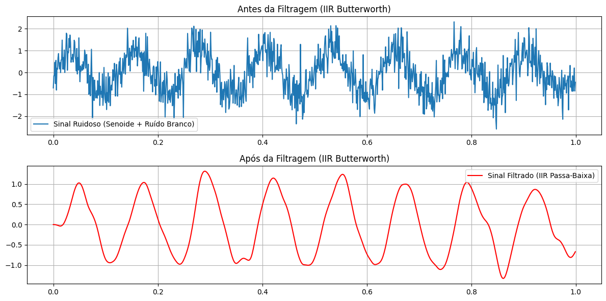

## 1. Código da atividade (Feito no Google Colab)
```python
import numpy as np
import matplotlib.pyplot as plt
from scipy.signal import butter, lfilter

fs = 1000
t = np.linspace(0, 1, fs, endpoint=False)
f_sinal = 8

sinal_puro = np.sin(2 * np.pi * f_sinal * t)
ruido = np.random.normal(0, 0.6, len(t))
sinal_ruidoso = sinal_puro + ruido

fcorte = 25
b, a = butter(4, fcorte, fs=fs, btype='low')
sinal_filtrado = lfilter(b, a, sinal_ruidoso)

plt.figure(figsize=(12, 6))
plt.subplot(2, 1, 1)
plt.plot(t, sinal_ruidoso, label='Sinal Ruidoso (Senoide + Ruído Branco)')
plt.grid(True)
plt.legend()
plt.subplot(2, 1, 1).set_title('Antes da Filtragem (IIR Butterworth)')

plt.subplot(2, 1, 2)
plt.plot(t, sinal_filtrado, label='Sinal Filtrado (IIR Passa-Baixa)', color='red')
plt.grid(True)
plt.legend()
plt.subplot(2, 1, 2).set_title('Após da Filtragem (IIR Butterworth)')

plt.tight_layout()
plt.show()
```


## 2. Gráficos gerados




### 3. Discussão técnica
Neste experimento, repetiu-se o cenário de filtragem sobre o sinal contaminado por ruído branco aditivo, substituindo o filtro FIR anterior por um filtro IIR (Resposta ao Impulso Infinita) com topologia Butterworth. O objetivo central é estabelecer um paralelo direto de desempenho entre as duas principais classes de filtros digitais.  O filtro Butterworth de tipo IIR destaca-se por possuir uma resposta em magnitude maximalmente plana na banda de passagem, garantindo que não ocorram ondulações (ripples) que distorçam as amplitudes das frequências de interesse. Devido à sua natureza recursiva, que utiliza realimentação de saídas anteriores, ele consegue obter uma transição espectral muito mais abrupta do que o filtro FIR com um número drasticamente menor de coeficientes matemáticos, reduzindo o custo computacional necessário.  Entretanto, ao comparar o resultado temporal com o da Questão 2, evidencia-se o compromisso de projeto envolvido: o filtro IIR introduz uma resposta de fase não-linear. Fisicamente, essa não-linearidade provoca um atraso de grupo variável ao longo do espectro, causando uma sutil distorção harmônica transiente e deslocamento temporal no início do sinal filtrado. Apesar disso, a atenuação do ruído de alta frequência na banda de rejeição mostra-se altamente eficiente no domínio do tempo.  