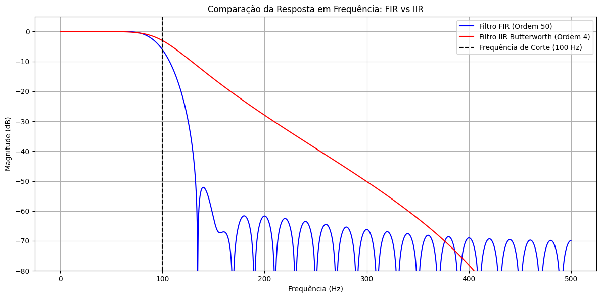

## 1. Código da atividade (Feito no Google Colab)
```jupyter
import numpy as np
import matplotlib.pyplot as plt
from scipy.signal import butter, firwin, freqz

fs = 1000
fcorte = 100

b_fir = firwin(51, fcorte, fs=fs)
w_fir, h_fir = freqz(b_fir, [1.0], worN=2000, fs=fs)

b_iir, a_iir = butter(4, fcorte, fs=fs, btype='low')
w_iir, h_iir = freqz(b_iir, a_iir, worN=2000, fs=fs)

plt.figure(figsize=(12, 6))
plt.plot(w_fir, 20 * np.log10(np.abs(h_fir)), label='Filtro FIR (Ordem 50)', color='blue')
plt.plot(w_iir, 20 * np.log10(np.abs(h_iir)), label='Filtro IIR Butterworth (Ordem 4)', color='red')
plt.axvline(fcorte, color='black', linestyle='--', label='Frequência de Corte (100 Hz)')
plt.ylim(-80, 5)
plt.xlabel('Frequência (Hz)')
plt.ylabel('Magnitude (dB)')
plt.title('Comparação da Resposta em Frequência: FIR vs IIR')
plt.grid(True)
plt.legend()
plt.tight_layout()
plt.show()
```


## 2. Gráficos gerados




### 3. Discussão técnica
Nesta atividade, realizou-se uma comparação direta entre as respostas em frequência de um filtro FIR (projetado pelo método da janela) e um filtro IIR (Butterworth) configurados com frequências de corte semelhantes. O gráfico gerado avalia o comportamento da magnitude em decibéis ($dB$) ao longo do espectro, expondo as vantagens e limitações de cada topologia.  A primeira diferença marcante está na região de transição, que determina a seletividade do filtro. Mesmo utilizando uma ordem numérica muito menor ($N=4$ no IIR contra $N=50$ no FIR), o filtro IIR Butterworth apresenta uma queda de ganho muito mais íngreme imediatamente após a frequência de corte. Isso demonstra uma eficiência computacional significativamente superior para atingir especificações de atenuação severas. Para que o filtro FIR alcançasse uma inclinação de atenuação similar, seria necessário expandir drasticamente o número de taps (coeficientes), elevando o custo de processamento matemático por amostra.  Por outro lado, o filtro Butterworth exibe uma atenuação contínua e monótona na banda de rejeição, enquanto o filtro FIR baseado em janelamento exibe ondulações secundárias (sidelobes) características do efeito de Gibbs. Essas ondulações limitam o nível máximo de rejeição em frequências mais altas, exigindo o uso de janelas matemáticas específicas para balancear a largura da banda de transição e o nível de atenuação dos lobos secundários.