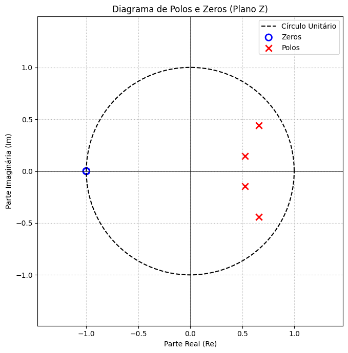

## 1. Código da atividade (Feito no Google Colab)
```python
import numpy as np
import matplotlib.pyplot as plt
from scipy.signal import butter, tf2zpk

fs = 1000
fcorte = 100

b, a = butter(4, fcorte, fs=fs, btype='low')
z, p, k = tf2zpk(b, a)

plt.figure(figsize=(7, 7))
theta = np.linspace(0, 2 * np.pi, 200)
plt.plot(np.cos(theta), np.sin(theta), 'k--', label='Círculo Unitário')

plt.scatter(np.real(z), np.imag(z), s=80, facecolors='none', edgecolors='blue', marker='o', linewidths=2, label='Zeros')
plt.scatter(np.real(p), np.imag(p), s=80, color='red', marker='x', linewidths=2, label='Polos')

plt.axhline(0, color='black', linestyle='-', linewidth=0.5)
plt.axvline(0, color='black', linestyle='-', linewidth=0.5)
plt.grid(True, which='both', axis='both', linestyle=':')
plt.title('Diagrama de Polos e Zeros (Plano Z)')
plt.xlabel('Parte Real (Re)')
plt.ylabel('Parte Imaginária (Im)')
plt.legend(loc='upper right')
plt.axis('equal')
plt.xlim(-1.5, 1.5)
plt.ylim(-1.5, 1.5)
plt.tight_layout()
plt.show()
```


## 2. Gráficos gerados




### 3. Discussão técnica
A análise de estabilidade de um sistema discreto LTI passa obrigatoriamente pelo estudo das raízes dos polinômios de sua função de transferência no domínio $Z$, isto é, os seus polos e zeros. Os zeros são as raízes do polinômio do numerador e indicam as frequências complexas nas quais o ganho do filtro cai para zero. Os polos são as raízes do polinômio do denominador e representam as frequências complexas nas quais o ganho tende ao infinito, ditando o comportamento dinâmico e a estabilidade do sistema.  Fisicamente, para garantir que o filtro seja estável (critério BIBO - Bounded-Input Bounded-Output), todos os seus polos devem estar localizados estritamente dentro do círculo unitário de raio $1$ no plano complexo $Z$ ($|z| < 1$). Se algum polo estiver exatamente sobre o círculo unitário ($|z| = 1$), o filtro apresentará uma oscilação sustentada (marginalmente estável). Se houver qualquer polo fora do círculo unitário ($|z| > 1$), a resposta ao impulso crescerá exponencialmente ao longo do tempo, gerando divergência matemática e saturação do hardware.  Nesta simulação, mapeamos o diagrama de polos e zeros de um filtro IIR Butterworth. Observa-se que todos os polos gerados se posicionam de maneira simétrica no interior do círculo unitário, o que comprova numericamente a estabilidade do filtro projetado. Os zeros, por sua vez, agrupam-se na periferia do círculo na região de frequências que o filtro visa rejeitar.