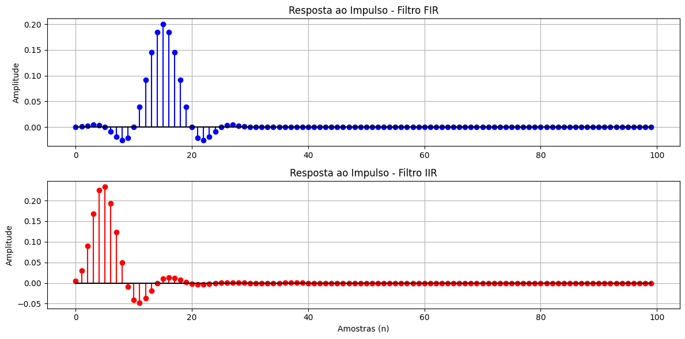

## 1. Código da atividade (Feito no Google Colab)
```jupyter
import numpy as np
import matplotlib.pyplot as plt
from scipy.signal import butter, firwin, lfilter

N = 100
impulso = np.zeros(N)
impulso[0] = 1.0

b_fir = firwin(31, 0.2)
h_fir = lfilter(b_fir, [1.0], impulso)

b_iir, a_iir = butter(4, 0.2, btype='low')
h_iir = lfilter(b_iir, a_iir, impulso)

plt.figure(figsize=(12, 6))

plt.subplot(2, 1, 1)
plt.stem(range(N), h_fir, linefmt='b-', markerfmt='bo', basefmt='k-')
plt.title('Resposta ao Impulso - Filtro FIR')
plt.ylabel('Amplitude')
plt.grid(True)

plt.subplot(2, 1, 2)
plt.stem(range(N), h_iir, linefmt='r-', markerfmt='ro', basefmt='k-')
plt.title('Resposta ao Impulso - Filtro IIR')
plt.xlabel('Amostras (n)')
plt.ylabel('Amplitude')
plt.grid(True)

plt.tight_layout()
plt.show()
```

## 2. Gráficos gerados




### 3. Discussão técnica
A análise comparativa da resposta ao impulso entre as topologias FIR e IIR expõe de forma clara a diferença estrutural e matemática que define as duas classes de filtros digitais.  A resposta ao impulso de um filtro FIR (Resposta ao Impulso Finita) possui uma duração estritamente limitada no tempo. Como sua equação de diferenças é não-recursiva — dependendo exclusivamente das amostras atuais e passadas do sinal de entrada —, os coeficientes do filtro são os próprios valores da resposta ao impulso. Assim que o pulso unitário inicial ($1$ na amostra zero e $0$ nas demais) se desloca completamente através da linha de atraso do filtro, a saída zera de forma absoluta e permanente. Esse comportamento garante a estabilidade inerente do sistema, pois não há caminhos de realimentação que propaguem o sinal indefinidamente.  Por outro lado, o filtro IIR (Resposta ao Impulso Infinita) possui uma resposta que, teoricamente, se prolonga de forma perpétua. Isso ocorre porque sua estrutura é recursiva, fazendo com que a saída atual dependa de valores previamente calculados da própria saída. Quando o pulso unitário excita o sistema, ele entra em um laço de realimentação (feedback). Em um filtro estável, esses valores decaem exponencialmente em direção a zero à medida que o tempo tende ao infinito, mas nunca se anulam de forma absoluta em um número finito de passos. Essa propriedade permite que o IIR armazene energia no sistema, alcançando alta seletividade espectral com estruturas matemáticas enxutas.  