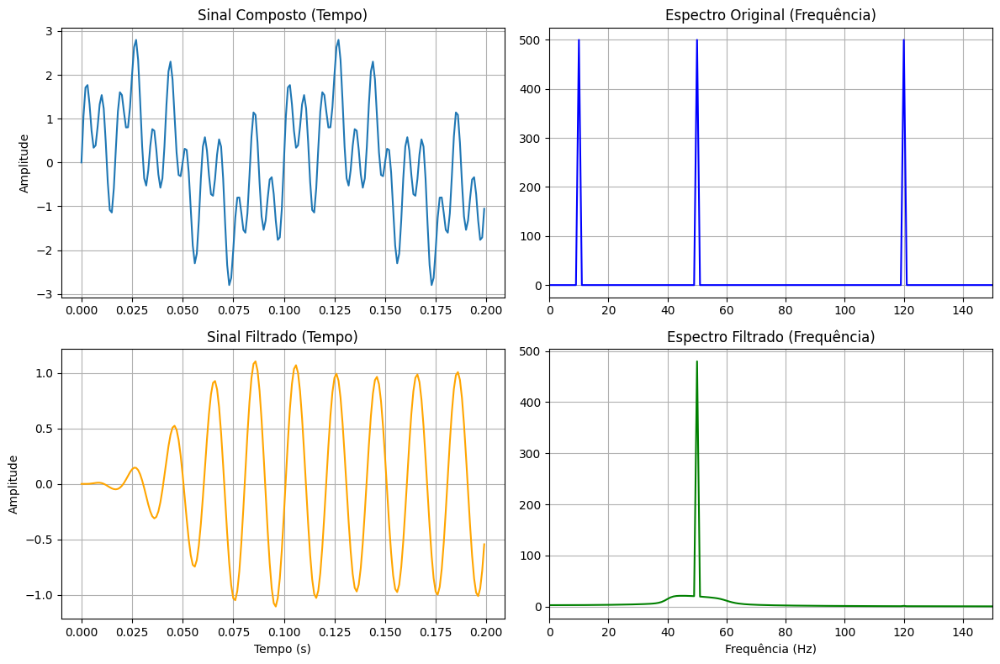

## 1. Código da atividade (Feito no Google Colab)
```python
import numpy as np
import matplotlib.pyplot as plt
from scipy.signal import butter, lfilter

fs = 1000
t = np.linspace(0, 1, fs, endpoint=False)

f1 = 10
f2 = 50
f3 = 120

sinal = np.sin(2 * np.pi * f1 * t) + np.sin(2 * np.pi * f2 * t) + np.sin(2 * np.pi * f3 * t)

f_baixa = 40
f_alta = 60
b, a = butter(4, [f_baixa, f_alta], fs=fs, btype='bandpass')
sinal_filtrado = lfilter(b, a, sinal)

freqs = np.fft.rfftfreq(len(t), 1/fs)
fft_antes = np.abs(np.fft.rfft(sinal))
fft_depois = np.abs(np.fft.rfft(sinal_filtrado))

plt.figure(figsize=(12, 8))

plt.subplot(2, 2, 1)
plt.plot(t[:200], sinal[:200])
plt.title('Sinal Composto (Tempo)')
plt.ylabel('Amplitude')
plt.grid(True)

plt.subplot(2, 2, 2)
plt.plot(freqs, fft_antes, color='blue')
plt.title('Espectro Original (Frequência)')
plt.xlim(0, 150)
plt.grid(True)

plt.subplot(2, 2, 3)
plt.plot(t[:200], sinal_filtrado[:200], color='orange')
plt.title('Sinal Filtrado (Tempo)')
plt.xlabel('Tempo (s)')
plt.ylabel('Amplitude')
plt.grid(True)

plt.subplot(2, 2, 4)
plt.plot(freqs, fft_depois, color='green')
plt.title('Espectro Filtrado (Frequência)')
plt.xlabel('Frequência (Hz)')
plt.xlim(0, 150)
plt.grid(True)

plt.tight_layout()
plt.show()
```


## 2. Gráficos gerados




### 3. Discussão técnica
Nesta atividade, o objetivo desloca-se para o isolamento de uma componente espectral intermediária específica por meio de um filtro passa-faixa (bandpass). O sinal composto simulado simula um cenário real de comunicações ou de instrumentação, onde coexistem três componentes harmônicas bem definidas: uma oscilação lenta de baixa frequência ($10\text{ Hz}$), uma senoide intermediária ($50\text{ Hz}$) que carrega a informação de interesse, e uma componente espúria de alta frequência ($120\text{ Hz}$).Para selecionar unicamente a componente central, projetou-se um filtro passa-faixa com frequências de corte inferior e superior posicionadas simetricamente ao redor da frequência alvo de $50\text{ Hz}$. A operação do filtro consiste em impor atenuação severa em duas regiões distintas do espectro simultaneamente: na banda de rejeição inferior (eliminando o sinal de $10\text{ Hz}$) e na banda de rejeição superior (eliminando o sinal de $120\text{ Hz}$), permitindo o trânsito livre de energia apenas na faixa espectral delimitada.A validação do resultado é realizada no domínio da frequência utilizando a Transformada Rápida de Fourier (FFT), que mapeia a densidade espectral de potência do sinal. No gráfico espectral pré-filtragem, observam-se claramente os três picos de magnitude correspondentes às três frequências de entrada. Após a filtragem, o gráfico espectral revela a eliminação completa dos picos laterais, restando apenas a componente isolada de $50\text{ Hz}$. No domínio do tempo, o comportamento caótico do sinal composto é puramente transformado em uma senoide limpa e uniforme.