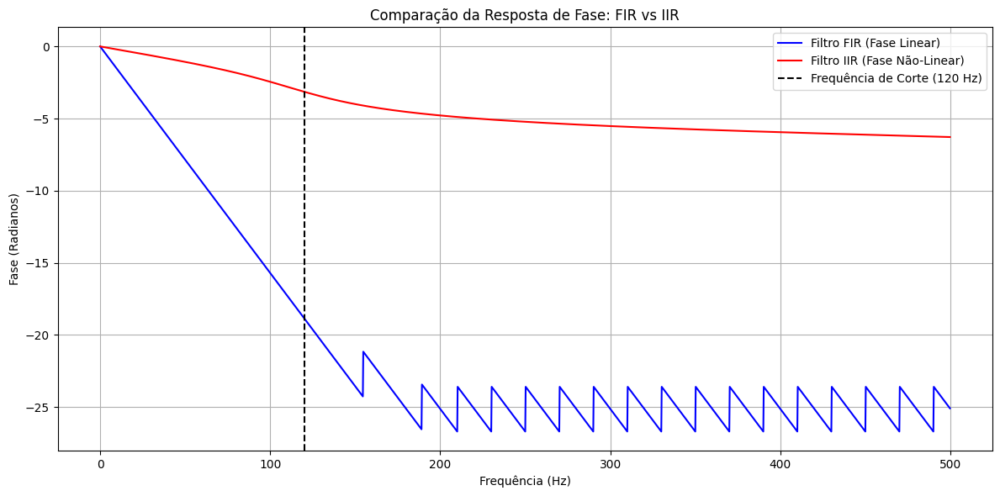

## 1. Código da atividade (Feito no Google Colab)
```jupyter
import numpy as np
import matplotlib.pyplot as plt
from scipy.signal import butter, firwin, freqz

fs = 1000
fcorte = 120

b_fir = firwin(51, fcorte, fs=fs)
w_fir, h_fir = freqz(b_fir, [1.0], worN=2000, fs=fs)

b_iir, a_iir = butter(4, fcorte, fs=fs, btype='low')
w_iir, h_iir = freqz(b_iir, a_iir, worN=2000, fs=fs)

plt.figure(figsize=(12, 6))

plt.plot(w_fir, np.unwrap(np.angle(h_fir)), label='Filtro FIR (Fase Linear)', color='blue')
plt.plot(w_iir, np.unwrap(np.angle(h_iir)), label='Filtro IIR (Fase Não-Linear)', color='red')

plt.axvline(fcorte, color='black', linestyle='--', label='Frequência de Corte (120 Hz)')
plt.xlabel('Frequência (Hz)')
plt.ylabel('Fase (Radianos)')
plt.title('Comparação da Resposta de Fase: FIR vs IIR')
plt.grid(True)
plt.legend()
plt.tight_layout()
plt.show()
```


## 2. Gráficos gerados




### 3. Discussão técnica
A análise da resposta de fase de um filtro digital define como o sistema altera a relação temporal entre as diferentes componentes senoidais que compõem o sinal de entrada. Nesta simulação, ao plotar graficamente a curva de fase em relação à frequência para ambas as topologias (FIR e IIR), expõe-se uma das principais vantagens conceituais dos filtros de resposta ao impulso finita: a linearidade de fase.  O filtro FIR exibe uma resposta de fase perfeitamente linear, representada por uma reta com inclinação constante ao longo de toda a banda de passagem. Fisicamente, a fase linear decorre da simetria dos coeficientes do filtro FIR. Isso significa que todas as componentes harmônicas do sinal sofrem exatamente o mesmo atraso de tempo ao atravessar o sistema, preservando com fidelidade matemática a simetria e a forma de onda do sinal no domínio do tempo. Essa propriedade é essencial em aplicações críticas de instrumentação ou comunicações de alta velocidade, onde distorções na forma do pulso geram perda de informação.  Em contrapartida, o filtro IIR Butterworth apresenta uma resposta de fase nitidamente não-linear, exibindo uma curvatura acentuada, principalmente na região próxima à frequência de corte. Como os filtros IIR dependem de realimentação, diferentes frequências sofrem deslocamentos temporais distintos ao passar pelo filtro. Embora a magnitude do filtro IIR seja eficiente, essa dispersão de fase deforma transientes e introduz assimetria nas formas de onda originais, tornando-o inadequado para cenários onde a preservação temporal estrita é um requisito de projeto.