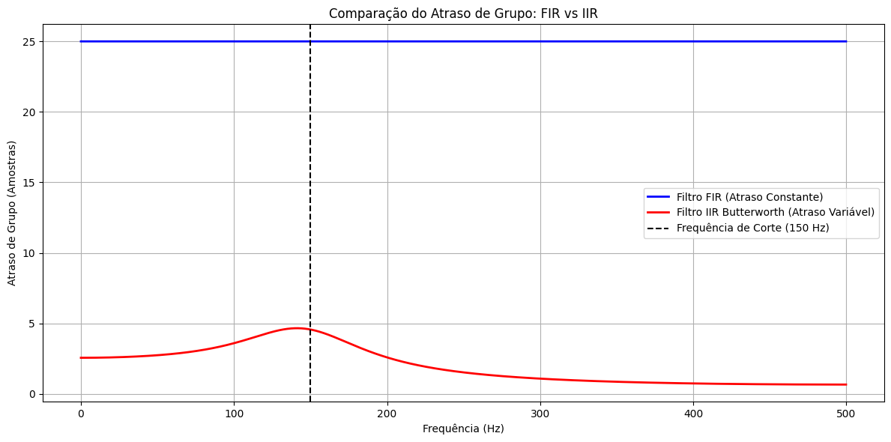

## 1. Código da atividade (Feito no Google Colab)
```python
import numpy as np
import matplotlib.pyplot as plt
from scipy.signal import butter, firwin, group_delay

fs = 1000
fcorte = 150

b_fir = firwin(51, fcorte, fs=fs)
w_fir, gd_fir = group_delay((b_fir, [1.0]), w=2000, fs=fs)

b_iir, a_iir = butter(4, fcorte, fs=fs, btype='low')
w_iir, gd_iir = group_delay((b_iir, a_iir), w=2000, fs=fs)

plt.figure(figsize=(12, 6))

plt.plot(w_fir, gd_fir, label='Filtro FIR (Atraso Constante)', color='blue', linewidth=2)
plt.plot(w_iir, gd_iir, label='Filtro IIR Butterworth (Atraso Variável)', color='red', linewidth=2)

plt.axvline(fcorte, color='black', linestyle='--', label='Frequência de Corte (150 Hz)')
plt.xlabel('Frequência (Hz)')
plt.ylabel('Atraso de Grupo (Amostras)')
plt.title('Comparação do Atraso de Grupo: FIR vs IIR')
plt.grid(True)
plt.legend()
plt.tight_layout()
plt.show()
```


## 2. Gráficos gerados




### 3. Discussão técnica
O atraso de grupo (group delay) é um parâmetro derivado da resposta de fase de um sistema, calculado matematicamente como a derivada negativa da fase em relação à frequência ($-\frac{d\theta(\omega)}{d\omega}$). Fisicamente, ele quantifica o tempo de atraso real medido em segundos (ou em número de amostras) que o envelope ou pacote de ondas de um determinado grupo de frequências sofre ao atravessar o filtro.  Nesta simulação, calculamos e comparamos o atraso de grupo de um filtro FIR e de um filtro IIR Butterworth. O filtro FIR apresenta um atraso de grupo perfeitamente constante e plano ao longo de todo o espectro. Isso significa que independentemente da frequência contida no sinal de entrada, todas serão deslocadas no tempo pelo mesmo intervalo exato, o que assegura a integridade geométrica da forma de onda original e elimina a distorção de fase.  Em contrapartida, o filtro IIR Butterworth exibe um atraso de grupo variável, que cresce de forma acentuada à medida que se aproxima da frequência de corte antes de decair na banda de rejeição. Esse comportamento significa que frequências diferentes sofrem tempos de atraso distintos ao trafegar pelo filtro.  Em sistemas de comunicação digital, esse parâmetro é crítico. Um atraso de grupo não constante provoca dispersão temporal dos pulsos transmitidos (frequências distintas que compõem o pulso chegam ao receptor em momentos diferentes), um fenômeno conhecido como distorção por atraso de grupo. Isso causa interferência intersimbólica (ISI), sobrepondo os bits adjacentes na linha de transmissão e elevando drasticamente a taxa de erro de bits (BER) do sistema de telecomunicação