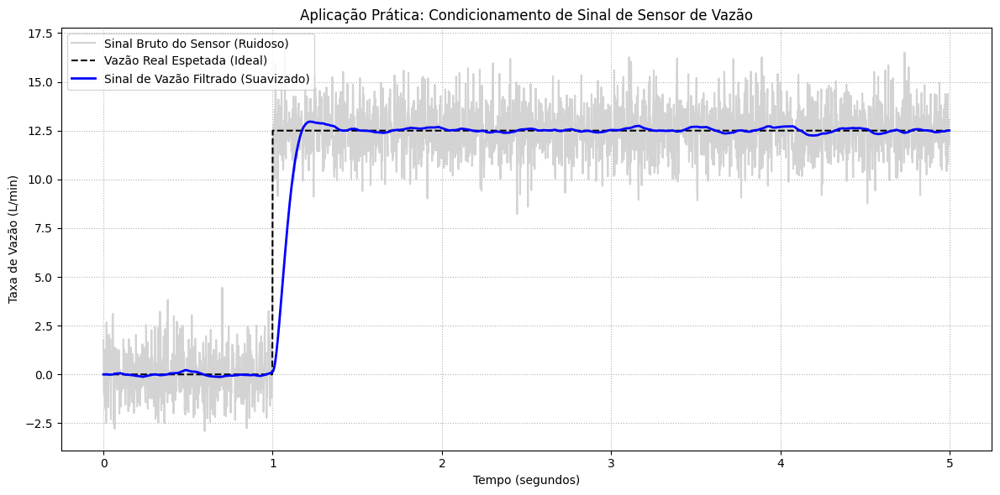

## 1. Código da atividade (Feito no Google Colab)
```python
import numpy as np
import matplotlib.pyplot as plt
from scipy.signal import butter, lfilter

fs = 500
t = np.linspace(0, 5, fs * 5, endpoint=False)

vazao_nominal = np.zeros_like(t)
vazao_nominal[t >= 1.0] = 12.5

ruido_turbulencia = np.random.normal(0, 1.2, len(t))
ruido_alta_freq = 0.5 * np.sin(2 * np.pi * 60 * t)
sinal_sensor_vazao = vazao_nominal + ruido_turbulencia + ruido_alta_freq

fcorte = 3.0
b, a = butter(2, fcorte, fs=fs, btype='low')
sinal_vazao_suavizado = lfilter(b, a, sinal_sensor_vazao)

plt.figure(figsize=(12, 6))
plt.plot(t, sinal_sensor_vazao, color='lightgray', label='Sinal Bruto do Sensor (Ruidoso)')
plt.plot(t, vazao_nominal, 'k--', label='Vazão Real Espetada (Ideal)', linewidth=1.5)
plt.plot(t, sinal_vazao_suavizado, color='blue', label='Sinal de Vazão Filtrado (Suavizado)', linewidth=2)

plt.title('Aplicação Prática: Condicionamento de Sinal de Sensor de Vazão')
plt.xlabel('Tempo (segundos)')
plt.ylabel('Taxa de Vazão (L/min)')
plt.grid(True, linestyle=':')
plt.legend(loc='upper left')
plt.tight_layout()
plt.show()
```


## 2. Gráficos gerados




### 3. Discussão técnica
Para cumprir o requisito de implementar uma aplicação prática com interpretação física, esta simulação aborda o Condicionamento e Suavização de Sinais de Sensores de Vazão. Em ambientes industriais ou de saneamento, os sensores mecânicos, ópticos ou ultrassônicos frequentemente sofrem com ruídos hidrodinâmicos transientes de alta frequência (causados por turbulência, cavitação ou bolhas de ar na tubulação) e ruído elétrico de modo comum induzido pelo circuito de aquisição.  O sinal de vazão real foi modelado como um degrau de fluxo (quando a válvula se abre e o fluido atinge um regime permanente) corrompido por ruídos aleatórios de alta frequência. Para suavizar a medição e garantir a estabilização das leituras sem inserir oscilações numéricas indesejadas , projetou-se um filtro IIR Butterworth passa-baixa de 2ª ordem.  A análise física dos resultados revela que o sinal bruto exibe flutuações severas e picos que induziriam o sistema de controle a leituras errôneas e acionamentos falsos de alarmes ou atuadores. Após a passagem pelo filtro digital, as oscilações espúrias são eliminadas, restaurando o perfil real do comportamento hidráulico (a transição suave e a estabilização do fluxo no tubo). Isso comprova como a filtragem digital em tempo real viabiliza tomadas de decisão robustas em malhas de automação baseadas em microcontroladores.