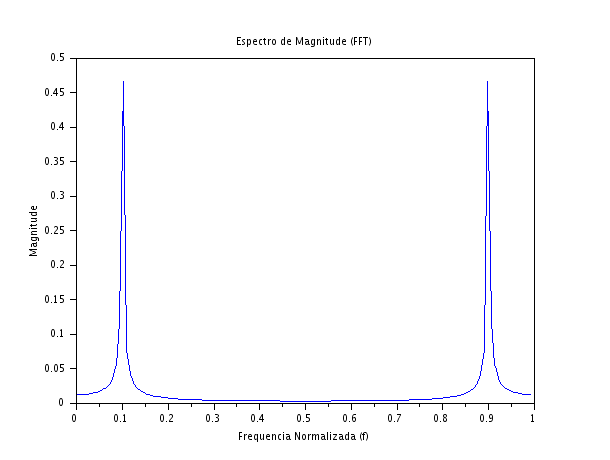
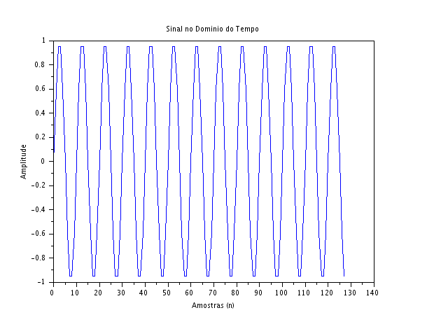

### Código Scilab:
```javascript
clear;
clc;

f0 = 0.1;
N = 128;

n = 0:N-1;

x = sin(2*%pi*f0*n);

X = fft(x);
Xm = abs(X)/N;

f = (0:N-1)/N;

// Figura 1
scf(1);
plot(n, x);
xtitle("Sinal no Dominio do Tempo", "Amostras (n)", "Amplitude");

// Figura 2
scf(2);
plot(f, Xm);
xtitle("Espectro de Magnitude (FFT)", "Frequencia Normalizada (f)", "Magnitude");
```
### Gráficos gerados





### Discussão Técnica dos Resultados

- **Identificação da Frequência Dominante:** A análise do gráfico espectral (Figura 2) revela um pico bem
definido exatamente na frequência normalizada $f = 0,1$, o que comprova experimentalmente os parâmetros de geração do sinal. A magnitude do pico é exatamente $0,5$. Isso encontra perfeita justificativa na identidade de Euler, que decompõe matematicamente a função seno em duas exponenciais complexas conjugadas de sentidos opostos, dividindo a amplitude total (que é $1$) igualmente entre as componentes de frequência positiva ($0,1$) e negativa/espelhada ($0,9$).
- **Relação entre os Domínios:** Enquanto no domínio do tempo o sinal estende-se por todo o intervalo de amostragem de forma oscilatória (ocupando espaço e memória continuamente), no domínio da frequência a informação é representada de forma extremamente esparsa e compacta. Toda a dinâmica e energia do sinal foram sintetizadas em um único ponto crítico do espectro ($f = 0,1$), evidenciando o poder da FFT em isolar e identificar componentes harmônicas puras.  
