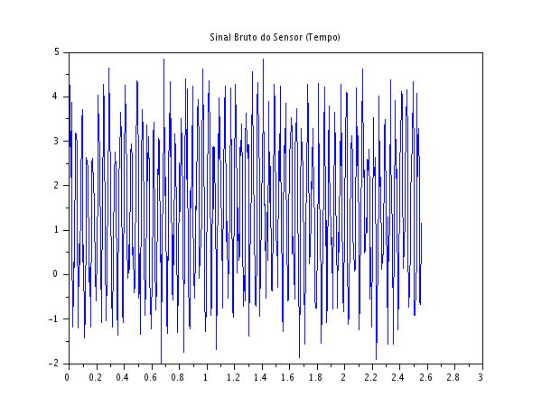
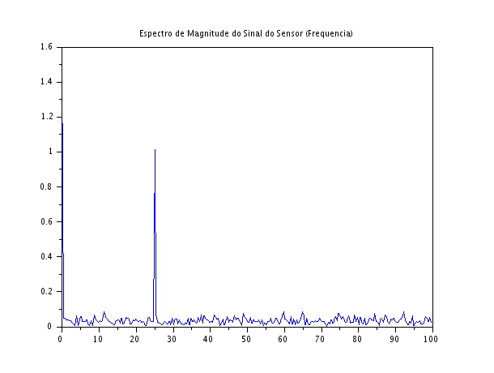

### Código Scilab
```javascript
clear;
clc;

N = 512;
fs = 200;
n = 0:N-1;
t = n/fs;

f_sinal = 25;

x_offset = 1.5;
x_util = 2.0 * sin(2*%pi*f_sinal*t);
x_ruido = 3.0 * (rand(1, N) - 0.5);

x_sensor = x_offset + x_util + x_ruido;

X = fft(x_sensor);
Xm = abs(X)/N;
f = (0:N-1)*(fs/N);

scf(1);
plot(t, x_sensor);
xtitle("Sinal Bruto do Sensor (Tempo)");

scf(2);
plot(f(1:N/2), Xm(1:N/2));
xtitle("Espectro de Magnitude do Sinal do Sensor (Frequencia)");
```

### Gŕaficos Gerados





### Discussão Técnica e Resolução do Problema Norteador (PBL)

- **Interpretação Física dos Resultados:** A FFT (Figura 2) revelou a anatomia oculta do sinal bruto capturado pelo sensor. O pico em $0\text{ Hz}$ representa a componente contínua ou offset de tensão (a tendência estacionária ou calibração de base do hardware). O pico em $25\text{ Hz}$ isola a variável física dinâmica real que estávamos tentando monitorar (como a oscilação de uma pá de bomba ou a frequência de pulsação de um hidrômetro). O restante da energia dispersa na base representa a indução de ruído eletromagnético ou perturbação térmica aleatória de alta frequência.  
- **Resolução do Problema Norteador (Limitações Práticas na Aquisição):** Conforme proposto pela metodologia PBL deste estudo dirigido, a transição entre o sinal físico e a análise computacional impõe severas restrições práticas na engenharia:  
  1. **Escolha da Frequência de Amostragem ($f_s$):** Para monitorar um fenômeno de $25\text{ Hz}$, a taxa de amostragem foi fixada em $200\text{ Hz}$ ($fs > 2 \cdot f_{max}$), garantindo conformidade com o Teorema de Nyquist para blindar o sistema contra o efeito catastrófico de aliasing. Em sistemas reais, um filtro analógico anti-aliasing (passa-baixas) deve ser obrigatoriamente inserido antes do conversor Analógico-Digital (ADC) para garantir que nenhuma frequência externa acima de $100\text{ Hz}$ corrompa os dados.  
  2. **Tempo de Observação e Resolução Espectral ($\Delta f$):** A separação mínima entre as frequências que o computador consegue enxergar depende diretamente do comprimento do sinal e da taxa de amostragem ($\Delta f = fs/N$). Ao coletarmos $N = 512$ amostras a uma taxa de $200\text{ Hz}$, nossa resolução é de $\Delta f = 200/512 \approx 0.39\text{ Hz}$. Caso precisássemos discriminar componentes espectrais excessivamente próximas no mundo real, seríamos forçados a estender o tempo total de aquisição de dados.
   3. **Efeito do Truncamento Digital:** A leitura em blocos finitos de tempo cria descontinuidades artificiais nas bordas. Para análises de precisão onde o ruído de fundo é muito severo, faz-se indispensável o uso de funções de janelamento (como Hamming ou Hann) para atenuar as bordas do sinal no tempo antes de rodar a FFT, evitando que o vazamento espectral mascare harmónicos fracos de interesse.  