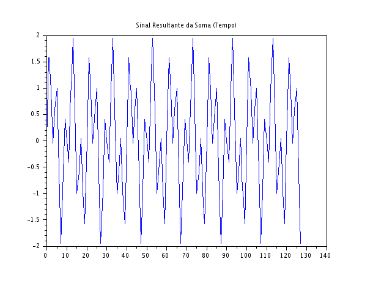
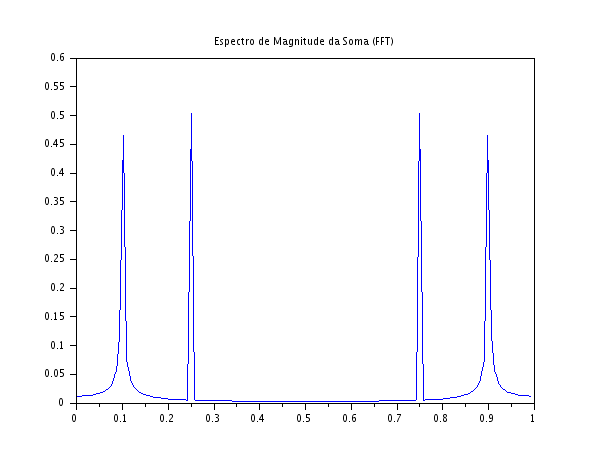

### Código Scilab

###
```javascript
clear;
clc;

N = 128;
n = 0:N-1;

f1 = 0.1;
f2 = 0.25;

x1 = sin(2*%pi*f1*n);
x2 = sin(2*%pi*f2*n);
x_sum = x1 + x2;

X = fft(x_sum);
Xm = abs(X)/N;

f = (0:N-1)/N;

scf(1);
plot(n, x_sum);
xtitle("Sinal Resultante da Soma (Tempo)");

scf(2);
plot(f, Xm);
xtitle("Espectro de Magnitude da Soma (FFT)");
```

### Gráficos gerados





### Discussão Técnica dos Resultados
- **Distinção das Componentes Frequenciais:** Analisando a Figura 2, o espectro obtido via FFT permite discriminar com absoluta clareza as duas componentes harmônicas. Mesmo que os sinais tenham sido misturados em uma única onda complexa no tempo, a transformada de Fourier agiu como um "prisma", separando o sinal resultante em suas frequências constituintes primitivas. Ambos os picos de interesse surgem nas posições exatas configuradas no código ($f = 0,1$ e $f = 0,25$) com magnitudes de $0,5$ cada.  
- **Relação entre o Domínio do Tempo e da Frequência:** Esta simulação ilustra perfeitamente a dualidade fundamental do processamento de sinais. No domínio do tempo, a informação visual é confusa: inspecionando visualmente o gráfico da onda resultante, é extremamente difícil (ou quase impossível) deduzir com exatidão quais frequências compõem aquela oscilação e quantas são. Já no domínio da frequência, a complexidade temporal desaparece, dando lugar a linhas verticais limpas que revelam imediatamente a "assinatura" ou a receita de composição do sinal.  