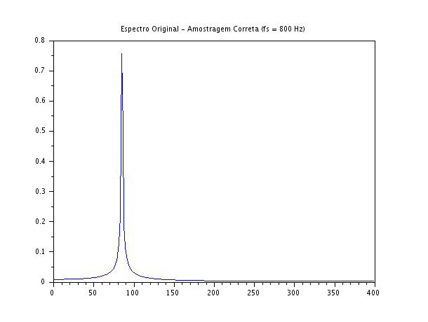
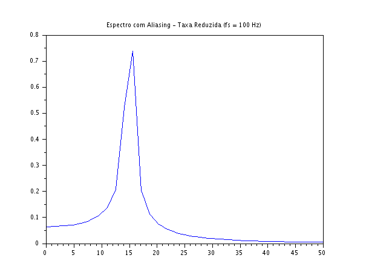

### Código Scilab
```javascript
clear;
clc;

f_sinal = 85; 

N1 = 512;
fs1 = 800;
n1 = 0:N1-1;
t1 = n1/fs1;
x1 = sin(2*%pi*f_sinal*t1);
X1 = fft(x1);
Xm1 = abs(X1)/(N1/2);
f1 = (0:N1-1)*(fs1/N1);

N2 = 64;
fs2 = 100;
n2 = 0:N2-1;
t2 = n2/fs2;
x2 = sin(2*%pi*f_sinal*t2);
X2 = fft(x2);
Xm2 = abs(X2)/(N2/2);
f2 = (0:N2-1)*(fs2/N2);

scf(1);
plot(f1(1:N1/2), Xm1(1:N1/2));
xtitle("Espectro Original - Amostragem Correta (fs = 800 Hz)");

scf(2);
plot(f2(1:N2/2+1), Xm2(1:N2/2+1));
xtitle("Espectro com Aliasing - Taxa Reduzida (fs = 100 Hz)");
```

### Gráficos gerados






### Discussão Técnica dos Resultados
- **Interpretação Física do Aliasing:** No primeiro cenário, a frequência de amostragem ($fs_1 = 800\text{ Hz}$) atende com folga ao Teorema de Nyquist, pois é muito maior que o dobro da frequência do sinal ($2 \times 85 = 170\text{ Hz}$). Por isso, o espectro na Figura 1 reflete a realidade física perfeitamente. No segundo cenário, ao reduzirmos drasticamente a taxa para $fs_2 = 100\text{ Hz}$, violamos o critério de Nyquist ($100\text{ Hz} < 170\text{ Hz}$). Como a taxa de amostragem tornou-se insuficiente para capturar as oscilações rápidas do sinal de $85\text{ Hz}$, os pontos coletados acabaram desenhando uma onda artificialmente mais lenta no tempo.  
- **Mecanismo Matemático do Erro:** Quando ocorre a violação de Nyquist, a frequência real do sinal se projeta para dentro da banda passante básica ($[-fs/2, fs/2]$) através de um efeito de rebatimento ou translação espectral. A nova posição aparente do pico ($f_{aliased}$) pode ser calculada encontrando a distância do sinal original para o múltiplo mais próximo da frequência de amostragem:  
$$f_{aliased} = |f_{sinal} - fs_2| = |85 - 100| = 15\text{ Hz}$$
Isso explica com precisão matemática por que o pico da Figura 2 migrou para $15\text{ Hz}$. Na prática da engenharia, esse fenômeno é uma distorção catastrófica e irreversível: uma vez que o sinal foi digitalizado com aliasing, nenhum algoritmo ou filtro digital subsequente será capaz de adivinhar se a componente de $15\text{ Hz}$ detectada era um sinal real de baixa frequência ou um fantasma de um sinal mais rápido.  