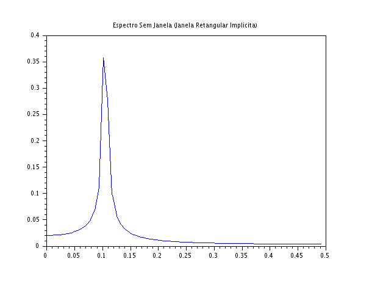
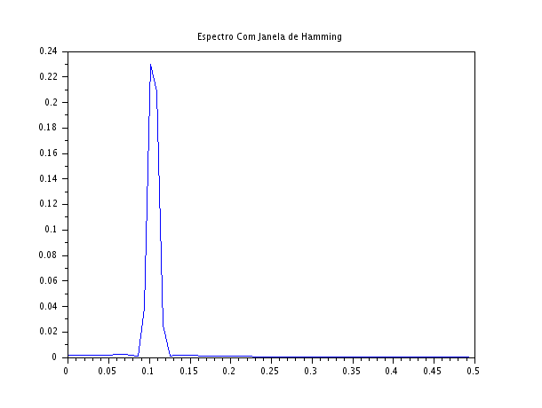

### Código Scilab
```javascript
clear;
clc;

N = 128;
n = 0:N-1;
f0 = 0.105;

x = sin(2*%pi*f0*n);

w = 0.54 - 0.46*cos(2*%pi*n/(N-1));
x_w = x .* w;

X = fft(x);
Xm = abs(X)/N;

X_w = fft(x_w);
Xm_w = abs(X_w)/N;

f = (0:N-1)/N;

scf(1);
plot(f(1:N/2), Xm(1:N/2));
xtitle("Espectro Sem Janela (Janela Retangular Implicita)");

scf(2);
plot(f(1:N/2), Xm_w(1:N/2));
xtitle("Espectro Com Janela de Hamming");
```

### Gráficos gerados





### Discussão Técnica dos Resultados
- **O Efeito do Vazamento Espectral (Spectral Leakage)**: Na Figura 1, como a frequência escolhida ($f_0 = 0,105$) não se encaixa perfeitamente em um divisor inteiro de $N$ ($128$), o sinal sofre uma descontinuidade abrupta ao ser truncado no início e no fim do bloco de amostras. Para o computador, essa quebra brusca no tempo equivale a introduzir dezenas de frequências espúrias. A energia que deveria estar concentrada estritamente em $0,105$ acaba "vazando" para os bins vizinhos.
- **A Influência do Janelamento no Espectro:** Na Figura 2, a janela de Hamming atua multiplicando o sinal por uma função suave que atenua os valores das extremidades, forçando-os a chegar a zero de forma gradual. Ao eliminar a transição abrupta no tempo, as componentes espúrias de alta frequência desaparecem no domínio da frequência.
- **O Compromisso de Engenharia (Trade-off):** Ao comparar detalhadamente os dois gráficos, nota-se que a janela de Hamming alarga um pouco a base do lobo principal (reduzindo a resolução tonal para separar frequências coladas), mas atenua drasticamente os lobos secundários (vazamento). Na prática da engenharia, esse mascaramento reduzido é fundamental para conseguirmos detectar um sinal muito fraco (pequena amplitude) que esteja próximo a uma componente de alta energia.