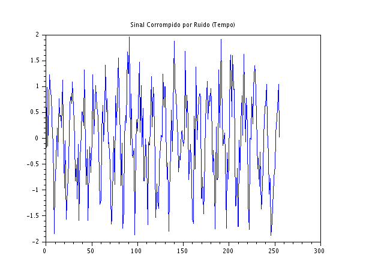
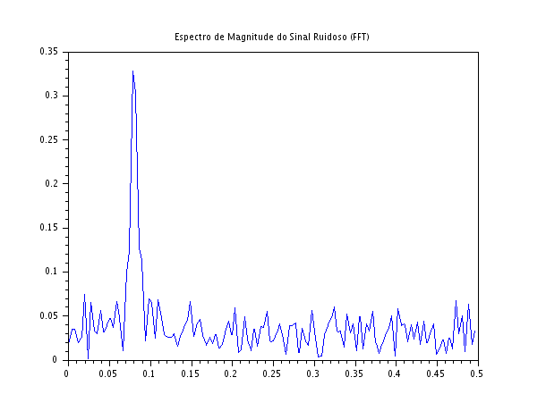

### Código Scilab

```javascript
clear;
clc;

N = 256;
n = 0:N-1;
f0 = 0.08;

x_pura = sin(2*%pi*f0*n);

ruido = 2 * (rand(1, N) - 0.5);
x_ruidoso = x_pura + ruido;

X = fft(x_ruidoso);
Xm = abs(X)/N;

f = (0:N-1)/N;

scf(1);
plot(n, x_ruidoso);
xtitle("Sinal Corrompido por Ruido (Tempo)");

scf(2);
plot(f(1:N/2), Xm(1:N/2));
xtitle("Espectro de Magnitude do Sinal Ruidoso (FFT)");
```

### Gráficos gerados





### Discussão Técnica dos Resultados

- **Dificuldade de Identificação no Tempo:** A análise temporal na Figura 1 evidencia as limitações da inspeção direta em sistemas reais. Em aplicações de engenharia, como sensores industriais, instrumentação ou leitura de dados de comunicação, os sinais físicos quase nunca são limpos. Se dependêssemos apenas do domínio do tempo para tomar uma decisão (como acionar uma válvula ou validar um limiar de amplitude), o ruído aditivo causaria falsos disparos devido à sua alta variação instantânea.
- **O Poder da Análise Espectral na Separação do Sinal:** O gráfico da FFT (Figura 2) demonstra por que a análise no domínio da frequência é indispensável. O ruído, por ser aleatório e desorganizado, espalha sua energia de forma homogênea por todas as frequências (característica de ruído de banda larga). Por outro lado, a senoide, por ser um sinal determinístico e periódico, concentra toda a sua energia em um único ponto espectral. Esse contraste cria um ganho de processamento que permite extrair o pico da frequência útil ($f = 0,08$) de dentro do "mar" de perturbações.
- **Aplicação Prática:** Esse tipo de análise constitui a base para o desenvolvimento de filtros digitais. Sabendo a posição exata da frequência principal através do espectro, um engenheiro pode projetar um filtro passa-faixa (band-pass filter) centrado em $0,08$ para eliminar todas as outras frequências adjacentes, isolando o sinal útil e eliminando praticamente todo o ruído aditivo antes de processar a informação final.