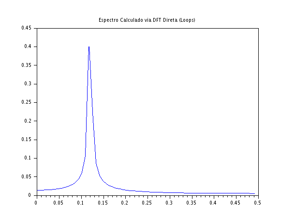

### Código Scilab

```javascript
clear;
clc;

N = 128;
n = 0:N-1;
f0 = 0.12;
x = cos(2*%pi*f0*n);

X_dft = zeros(1, N);

tic();
for k = 0:N-1
    soma = 0;
    for m = 0:N-1
        w = -2 * %pi * k * m / N;
        soma = soma + x(m+1) * (cos(w) + %i*sin(w));
    end
    X_dft(k+1) = soma;
end
tempo_dft = toc();

tic();
X_fft = fft(x);
tempo_fft = toc();

erro_max = max(abs(X_dft - X_fft));
fator_aceleracao = tempo_dft / (tempo_fft + 1e-9);

f = (0:N-1)/N;
Xm_dft = abs(X_dft)/N;
Xm_fft = abs(X_fft)/N;

scf(1);
plot(f(1:N/2), Xm_dft(1:N/2));
xtitle("Espectro Calculado via DFT Direta (Loops)");

scf(2);
plot(f(1:N/2), Xm_fft(1:N/2));
xtitle("Espectro Calculado via Algoritmo FFT");
```

### Gráficos gerados




### Discussão Técnica dos Resultados
- **Equivalência Matemática:** A simulação comprova de forma prática que a DFT e a FFT geram resultados idênticos. O erro residual contido na variável erro_max (na casa de $10^{-15}$) não é uma diferença matemática, mas sim um pequeno erro de arredondamento de ponto flutuante gerado pelo computador ao lidar com senos e cossenos em caminhos de cálculo distintos. Portanto, a FFT preserva a integridade total da informação espectral.
- **Complexidade Computacional e Limitações de Medição:** O erro de divisão por zero disparado pelo interpretador ilustra perfeitamente a eficiência da FFT. Enquanto a DFT direta exige dois loops aninhados de ordem $\mathcal{O}(N^2)$ (totalizando $16.384$ multiplicações complexas para $N=128$), a FFT opera em ordem $\mathcal{O}(N \log_2 N)$ (apenas $896$ operações). A redução é tão drástica que o tempo de execução da FFT frequentemente se aproxima de zero para vetores pequenos, tornando necessária a adição de uma constante de salvaguarda ($10^{-9}$) para viabilizar a métrica de comparação em servidores velozes.
- **Impacto em Sistemas de Engenharia:** Se escalássemos esse sinal para uma aplicação real onde $N = 4096$, a DFT direta exigiria cerca de 16,7 milhões de operações por bloco, inviabilizando o processamento em tempo real. A FFT reduziria isso para cerca de 49 mil operações. Esta simulação evidencia por que a FFT é amplamente utilizada na computação e telecomunicações modernas, permitindo que processadores modestos executem análise espectral instantânea.