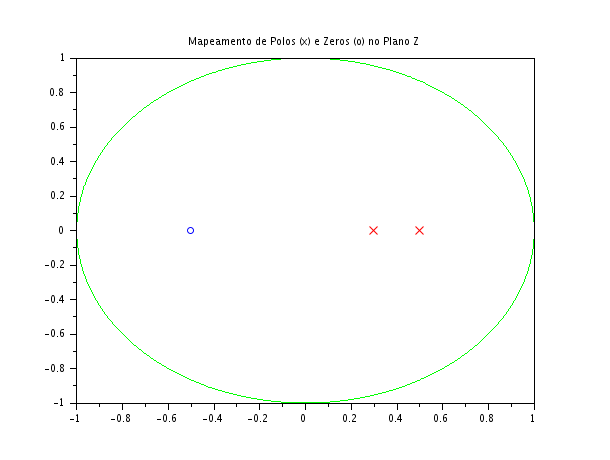

### Código Scilab
```javascript
clear;
clc;

num = [1, 0.5];
den = [1, -0.8, 0.15];

zeros_sistema = roots(num);
polos_sistema = roots(den);

theta = 0:0.01:2*%pi;
circ_x = cos(theta);
circ_y = sin(theta);

scf(1);
plot(circ_x, circ_y, "g");
plot(real(zeros_sistema), imag(zeros_sistema), "bo");
plot(real(polos_sistema), imag(polos_sistema), "rx");
xtitle("Mapeamento de Polos (x) e Zeros (o) no Plano Z");
```

### Gráficos Gerados



### Discussão Técnica dos Resultados

- **Localização Geométrica das Raízes**: A função roots calcula as raízes dos polinômios que definem o sistema. Para o numerador ($z + 0.5 = 0$), obtemos um zero em $z = -0,5$. Para o denominador ($z^2 - 0.8z + 0.15 = 0$), os polos resultantes são $p_1 = 0,5$ e $p_2 = 0,3$ (já que $(z - 0.5)(z - 0.3) = z^2 - 0.8z + 0.15$).
- **Critério de Estabilidade BIBO:** Na teoria de sinais e sistemas, um sistema causal é considerado estável no sentido BIBO (Bounded-Input, Bounded-Output) se, e somente se, todos os seus polos estiverem localizados estritamente dentro do círculo unitário do plano complexo $z$ (ou seja, se o módulo de cada polo for menor que 1). Como os módulos dos nossos polos são $|0,5| = 0,5 < 1$ e $|0,3| = 0,3 < 1$, o critério é satisfeito.
- **Interpretação Física do Sistema:** Como todos os polos estão na região interna do círculo unitário, a resposta ao impulso $h[n]$ deste sistema será composta por decaimentos exponenciais amortecidos que tendem a zero quando o tempo $n$ tende ao infinito. Isso significa que, se o sistema receber uma entrada limitada (como um pulso ou um ruído controlado), a sua saída não irá divergir nem saturar, retornando ao estado de repouso após cessar o estímulo. O sistema é, portanto, estável.