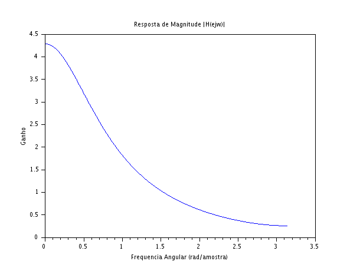
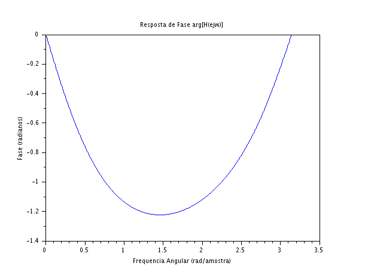

### Código Scilab
```javascript
clear;
clc;

w = 0:0.01:%pi;

H = zeros(1, length(w));

for k = 1:length(w)
    z = cos(w(k)) + %i*sin(w(k));
    num = 1 + 0.5 * (z^-1);
    den = 1 - 0.8 * (z^-1) + 0.15 * (z^-2);
    H(k) = num / den;
end

mag_H = abs(H);
fase_H = atan(imag(H), real(H));

scf(1);
plot(w, mag_H);
xtitle("Resposta de Magnitude |H(ejw)|", "Frequencia Angular (rad/amostra)", "Ganho");

scf(2);
plot(w, fase_H);
xtitle("Resposta de Fase arg[H(ejw)]", "Frequencia Angular (rad/amostra)", "Fase (radianos)");
```

### Gráficos gerados





### Discussão Técnica dos Resultados
- **Comportamento de Filtro Passa-Baixas:** A análise do gráfico de magnitude (Figura 1) revela de forma inequívoca que o sistema se comporta como um filtro passa-baixas. O gráfico mostra que o sistema oferece um ganho elevado para componentes de baixa frequência (próximas a $\omega = 0$) e atenua progressivamente as componentes de alta frequência (próximas a $\omega = \pi$).
- **Relação com os Polos e Zeros (Questão 7):** Esse comportamento espectral é perfeitamente explicado pela posição dos polos e zeros calculados na questão anterior. Os polos do sistema estão localizados no lado real positivo do plano Z ($z = 0,5$ e $z = 0,3$). Geometricamente, o círculo unitário passa muito mais perto desses polos quando estamos em frequências baixas ($\omega \approx 0$). Como a proximidade de um polo no plano Z atua "puxando" a magnitude para cima, o ganho nessa região é amplificado. À medida que caminhamos para as altas frequências ($\omega \rightarrow \pi$), nos afastamos dos polos e nos aproximamos do zero localizado em $z = -0,5$, o que "empurra" a magnitude para baixo.
- **Aplicação Prática:** Filtros com essa característica de resposta em frequência são amplamente utilizados em engenharia para suavização de sinais. Em um cenário real, esse sistema poderia ser implementado para eliminar ruídos de alta frequência vindos de sensores eletrônicos ou para realizar a filtragem primária de sinais cujas informações de interesse estejam concentradas nas bandas mais baixas do espectro.