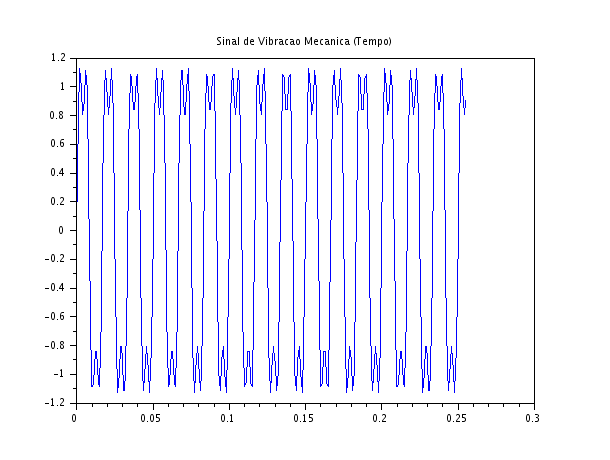
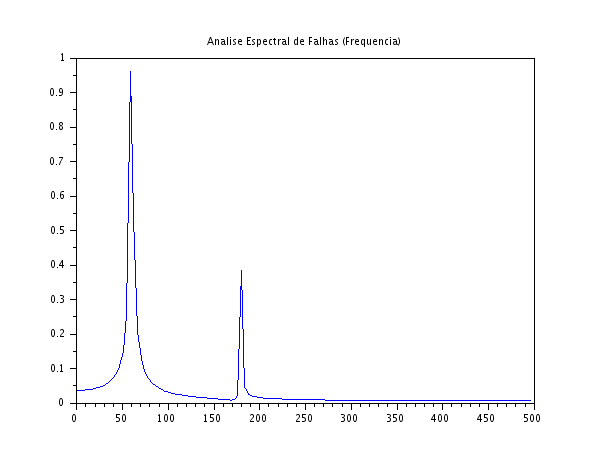

### Código Scilab
```javascript
clear;
clc;

N = 256;
fs = 1000;
n = 0:N-1;
t = n/fs;

f_fundamental = 60;
f_harmonica = 180;

x_vibracao = 1.2*sin(2*%pi*f_fundamental*t) + 0.4*sin(2*%pi*f_harmonica*t);

X = fft(x_vibracao);
Xm = abs(X)/(N/2);
f = (0:N-1)*(fs/N);

scf(1);
plot(t, x_vibracao);
xtitle("Sinal de Vibracao Mecanica (Tempo)");

scf(2);
plot(f(1:N/2), Xm(1:N/2));
xtitle("Analise Espectral de Falhas (Frequencia)");

```

### Gráficos Gerados





### Discussão Técnica dos Resultados
- **Identificação Qualitativa das Componentes:** A análise espectral (Figura 2) isola perfeitamente as duas frequências programadas no sinal. O pico em $60\text{ Hz}$ representa a frequência fundamental de rotação ou operação do sistema simulado. O segundo pico aparece em $180\text{ Hz}$, que corresponde matematicamente ao terceiro harmónico da componente principal ($3 \times 60 = 180\text{ Hz}$).  
- **Importância Prática no Diagnóstico de Falhas (PBL):** Em engenharia mecânica e manutenção preditiva industrial, a análise espectral de vibrações (feita por acelerómetros acoplados a motores, turbinas ou redutores) é uma das ferramentas mais poderosas de diagnóstico. Um motor elétrico s橋 em funcionamento normal exibe vibrações concentradas na sua frequência fundamental de rotação (ex: $60\text{ Hz}$ associados à rede elétrica ou rotação nominal). Se componentes harmónicas começarem a surgir ou crescer no espectro ao longo do tempo, isso serve como uma assinatura mecânica direta de falhas em estágio inicial.  
- **Interpretação Física das Assinaturas de Defeitos:** * O surgimento de um 2º harmónico ($2\times f_0$) geralmente indica problemas de desalinhamento de eixos ou empenamento.O surgimento de um 3º harmónico ($3\times f_0$), como o observado nesta questão ($180\text{ Hz}$), está frequentemente atrelado a folgas mecânicas estruturais, desgaste severo em acoplamentos ou problemas severos de fixação na base da máquina.  Frequências não inteiras e elevadas denotam tipicamente falhas nas pistas internas ou externas de rolamentos.

Transformar uma onda temporal caótica e oscilatória em bins discretos de frequência permite ao engenheiro identificar exatamente qual componente físico está a falhar sem a necessidade de abrir ou paralisar o maquinário industrial de forma destrutiva. 